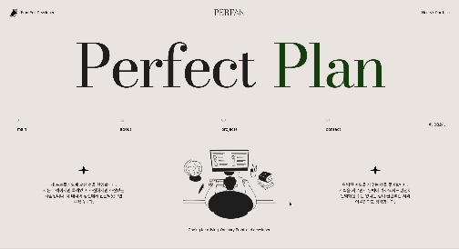

# React로 만든 포트폴리오 사이트

## 📝 프로젝트 소개

TypeScript를 기반으로 React 라이브러리를 사용해서 구현한 프로젝트입니다.  
프로젝트 구조부터 반응형 UI, 기능 확장성, 컴포넌트 재사용성 등을 신경써서 제작했습니다.

> [배포 링크 보러가기](https://perfan.vercel.app/)

## 👀 미리보기



## 🛠️ 개발 스택

- TypeScript
- React.js
- react-router-dom
- react-query
- styled-components
- supabase
- gsap

## 📁 구현 사항

### map 함수를 활용해서 섹션별로 UI를 출력

- 각 섹션의 내용을 담은 공통 변수를 contextAPI를 활용하여 전역에서 관리
- 화면을 따라다니는 Header, Nav, Scrollbar UI를 컴포넌트로 구현

```tsx
function Layout() {
  useAnimation()
  const { sections } = useCustomContext(SectionsContext)

  return (
    <StyledLayout>
      <Header />
      <Nav />
      <Scrollbar target={document.body} />
      <main>
        {sections.map((section) => (
          <SectionBox section={section} key={section.nav}>
            {section.content}
          </SectionBox>
        ))}
      </main>
    </StyledLayout>
  )
}
```

### supabase API 연동

- 페이지가 처음 로딩될 때마다 방문자 수를 올려주는 API가 동작하도록 구현
- 데이터베이스에 오늘 날짜를 담은 row가 자동으로 추가되도록 로직을 구현

```tsx
export async function updateUser() {
  const { data: user, error: selectError } = await supabase.from('user').select('*')

  if (selectError) {
    console.error(selectError)
    throw new Error('User could not be selected')
  }

  if (!user) return user

  const todaysVisitor = user.filter((item) => item.date === getToday())

  if (todaysVisitor.length > 0) {
    const { error: updateError } = await supabase
      .from('user')
      .update({ numVisitors: todaysVisitor[0].numVisitors + 1 })
      .eq('id', todaysVisitor[0].id)
      .select()

    if (updateError) {
      console.error(updateError)
      throw new Error('User could not be inserted')
    }
  } else {
    const { error: insertError } = await supabase
      .from('user')
      .insert([{ date: getToday(), numVisitors: 1 }])
      .select()

    if (insertError) {
      console.error(insertError)
      throw new Error('User could not be inserted')
    }
  }

  return user
}
```

### 이미지 로딩 최적화

- webp 확장자를 지원하는 브라우저에선 용량이 적은 webp 이미지를 출력하도록 구현
- width, height 속성을 추가하여 레이아웃을 그리는 시간을 단축
- `loading=lazy` 속성을 추가하여 이미지 로딩을 최적화

```tsx
function LazyImage({ src, ...otherProps }: LazyImageProps) {
  const isIcon = src.includes('.svg')
  const fileName = src.split('.')[0]

  return (
    <picture>
      {isIcon || <source srcSet={`webp/${fileName}.webp`} type="image/webp" />}
      
    </picture>
  )
}
```

### contextAPI를 활용한 컴포넌트

- 레이아웃에 따라 UI를 자유롭게 배치 할 수 있는 컴포넌트 구현
- context를 사용해서 prop drilling이 발생하지 않도록 조정

```tsx
const ListBoxContext = createContext(null)

function ListBox({ children }: ListBoxProps) {
  return (
    <ListBoxContext.Provider value={null}>
      <StyledListBox>{children}</StyledListBox>
    </ListBoxContext.Provider>
  )
}

function LeftSide({ children }: LeftSideProps) {
  return <StyledLeftSide>{children}</StyledLeftSide>
}

function RightSide({ children }: RightSideProps) {
  return <StyledRightSide>{children}</StyledRightSide>
}

function DotList({ main, children }: DotListProps) {
  return (
    <div>
      <StyledTitle>{main}</StyledTitle>
      <StyledDotList>{children}</StyledDotList>
    </div>
  )
}

function KeywordList({ main, children }: KeywordListProps) {
  return (
    <div>
      <StyledTitle>{main}</StyledTitle>
      <StyledKeywordList>{children}</StyledKeywordList>
    </div>
  )
}

ListBox.LeftSide = LeftSide
ListBox.RightSide = RightSide
ListBox.DotList = DotList
ListBox.KeywordList = KeywordList
```
